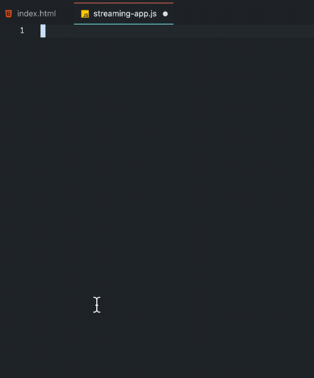

# js-streams-snippets

## Features

Some Web Streams API snippets for javascript and typescript files.

Provides snippets with tab triggers for:
- Readable Stream (<kbd>readable</kbd>)
- Writable Stream (<kbd>writable</kbd>)
- Transform Stream (<kbd>transform</kbd>)
- Readable - Transform - Writable Pipechain (<kbd>pipechain</kbd>)
- Get Reader (<kbd>reader</kbd>)
- Async Get Reader (<kbd>asyncreader</kbd>)
- Async Read Loop (<kbd>asyncreadloop</kbd>)
- Async Iterable ReadableStream (workaround) (<kbd>asynciterate</kbd>)
- Get Writer (<kbd>writer</kbd>)
- Async Get Writer (<kbd>asyncwriter</kbd>)

## Requirements

## Extension Settings

## Known Issues

## Release Notes

### 1.0.5

Fixed writable stream indentation.

### 1.0.4

Include screenshot.

### 1.0.3

Updated documentation.

### 1.0.2

Changelog. Typos.

### 1.0.1

Logo.

### 1.0.0

Initial release.

